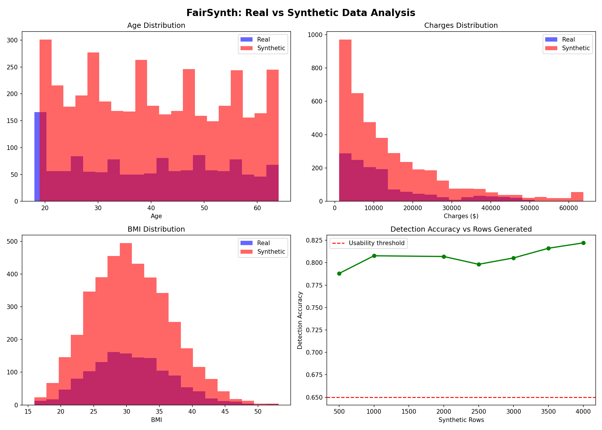

# FairSynth
### Evaluating Fairness and Utility Preservation in SDV-Generated Synthetic Healthcare Data

## Purpose
Healthcare AI systems that predict insurance costs often perform unequally across different patient demographics. Researchers who want to study and fix these inequalities face a major barrier, real patient data is private and cannot be shared.

FairSynth solves this by automatically generating synthetic patient data that mimics real healthcare datasets, then rigorously testing whether that synthetic data is trustworthy enough for research use. It measures fairness across age groups, generates statistically accurate synthetic data, and evaluates whether the synthetic data preserves real-world patterns.

## What It Does
FairSynth is a complete automated pipeline that:
- Detects performance inequality across age groups in healthcare cost prediction models
- Generates synthetic patient data using statistical methods (SDV/GaussianCopula)
- Compares fairness metrics between real and synthetic data
- Tests synthetic data quality using a discriminator model
- Works on any healthcare CSV dataset

## Key Findings

| Synthetic Rows | Detection Accuracy | Verdict |
|---------------|-------------------|---------|
| 500 | 78.8% | Somewhat detectable <- Sweet spot |
| 1000 | 80.8% | Somewhat detectable |
| 2000 | 80.7% | Somewhat detectable |
| 2500 | 79.8% | Somewhat detectable |
| 3000 | 80.5% | Somewhat detectable |
| 3500 | 81.6% | Somewhat detectable |
| 4000 | 82.2% | Somewhat detectable |

## Visualizations


## Conclusions
- LLM-generated synthetic data is not suitable for research (95% detectable)
- Statistical methods (SDV) significantly outperform LLMs for synthetic data generation
- The optimal synthetic dataset size is 500 rows — more rows does not improve quality
- Current synthetic data generation methods achieve approximately 79% detectability, indicating further research is needed before synthetic data can fully replace real patient data
- The model performs best for middle-aged patients (R²=0.84) and worst for younger patients (R²=0.66), revealing a systematic fairness gap in healthcare cost prediction

## How To Run
Download any healthcare CSV dataset and place it in the project folder, then:
```bash
python3 pipeline.py
```
Enter your filename and desired number of synthetic rows when prompted.

## Tech Stack
Python, scikit-learn, pandas, SDV, LangChain, Groq, matplotlib, Docker, Git
